## Список багов и их приоритеты:

1. **Орфографическая ошибка в тексте кнопки "Все категори"**
    - Описание: В кнопке "Все категории" орфографическая ошибка
    - Приоритет: Low
    - Аргументация: Ошибка в тексте не влияет на функциональность сайта, но может немного испортить восприятие бренда.
    
    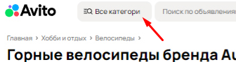

2. **Сообщение об ошибке отображается у успешно загруженной страницы**
    - Описание: Сообщение об ошибке должно отображаться только при сбое.
    - Приоритет: High
    - Аргументация: Ложное сообщение об ошибке может вызвать недоверие у пользователей, а также привести к лишним обращениям в поддержку.
    
    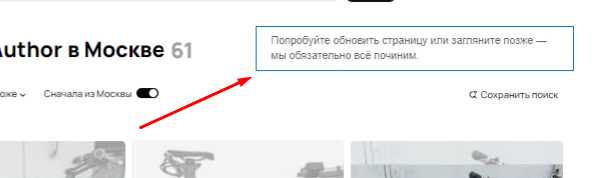

3. **Отсутствует конечная хлебная крошка "Горные"**
    - Описание: В хлебных крошках должна отображатся конечная хлебная крошка "Горные", т.к фильтрация идет именно по горным велосипедам.
    - Приоритет: Low
    - Аргументация: Это навигационный баг, но пользователи все равно могут продолжать работу, используя фильтры и поиск.
    
    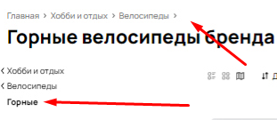

4. **Некорректное отображение вида объявлений**
    - Описание: Выбрано отображение объявлений на карте, но объявления отображаются в другом виде.
    - Приоритет: High
    - Аргументация: Если пользователь выбирает "отображение на карте", но объявления показываются в другом формате, это сломанный функционал, который может мешать поиску товаров.
    
    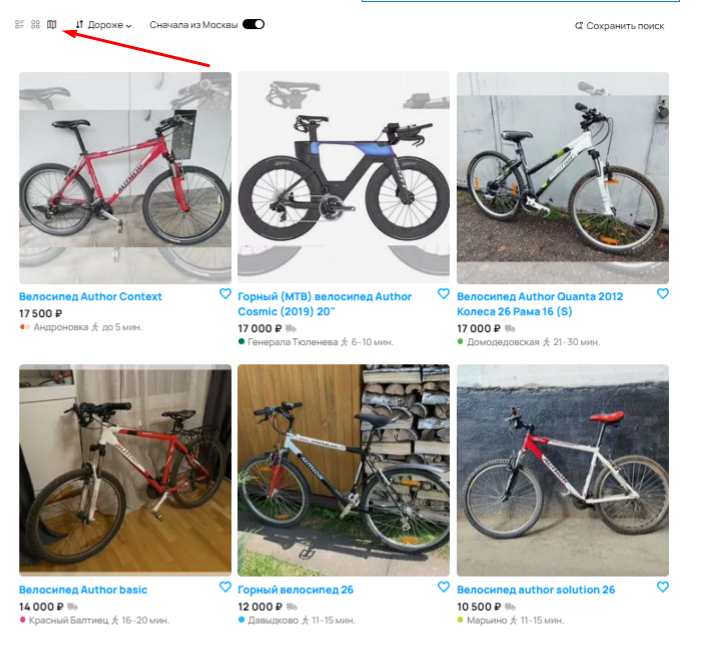

5. **Некорректная работа фильтра сортировки цены**
    - Описание: Фильтрация идет от самого дорого до дешевого, но объявления отбражаются в рандомном порядке.
    - Приоритет: High
    - Аргументация: Сортировка цен - один из ключевых инструментов, и если он работает неправильно, пользователи не могут эффективно искать нужные им объявления.
    
    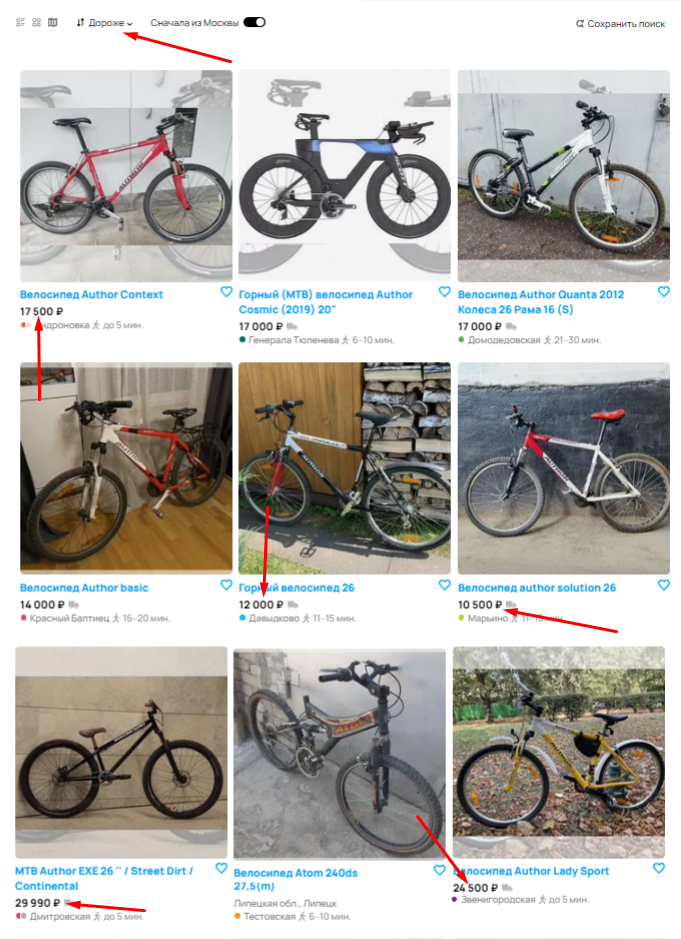

6. **В поисковую выдачу попало объявление не из города Москва**
    - Описание: Фильтрация объявлений "Cначала из Москвы", но 8 объявления из города Липецк.
    - Приоритет: High
    - Аргументация: Фильтрация по местоположению - важная функция. Если она работает неправильно, пользователи получают нерелевантные объявления, что снижает удобство.
    
    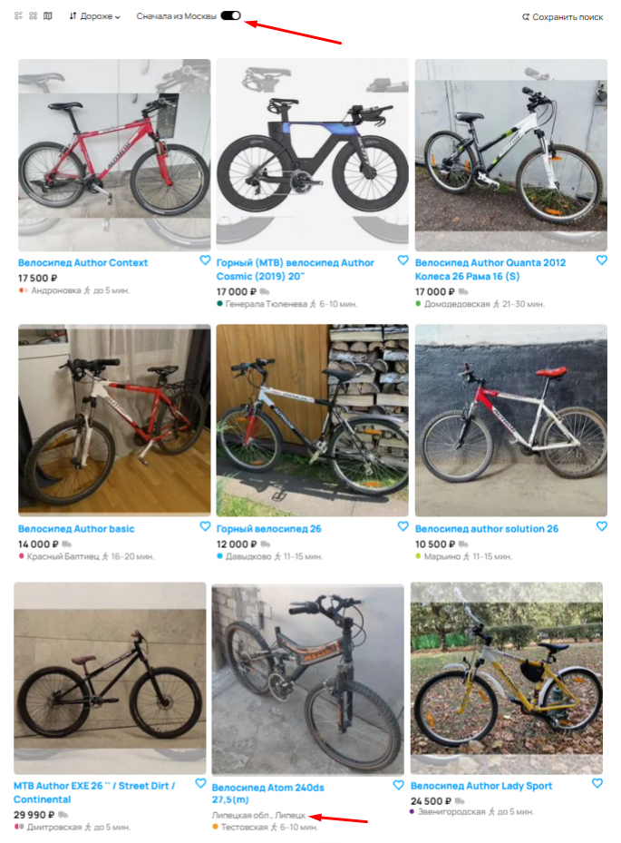

7. **Некорректное отображение изображения в объявлении**
    - Описание: Изображение в объявлении под номером 2 отображается некорректно.
    - Приоритет: Medium
    - Аргументация: Если изображение искажено или не отображается, это ухудшает пользовательский опыт, но объявления остаются доступными. (Но могу предположить что это ошибка со стороны пользователя)
    
    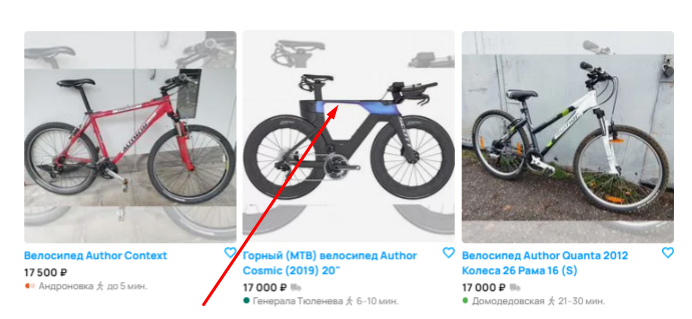

8. **Объявление без цены**
    - Описание: Объявление под номеров 8 отображается без цены.
    - Приоритет: Medium
    - Аргументация: Это проблема, но пользователи могут открыть объявление и уточнить стоимость.
    
    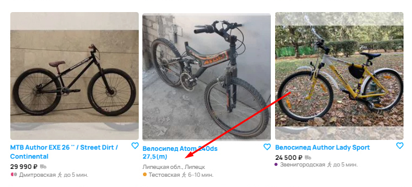

9. **Некорректное отображение пагинации**
    - Описание: Максимальное значение страниц в пагинации 100, но количество товаров соответствует 61, должно быть всего 6 вкладок.
    - Приоритет: Medium
    - Аргументация: Пагинация важна, но пользователи могут искать товары через фильтры.
    
    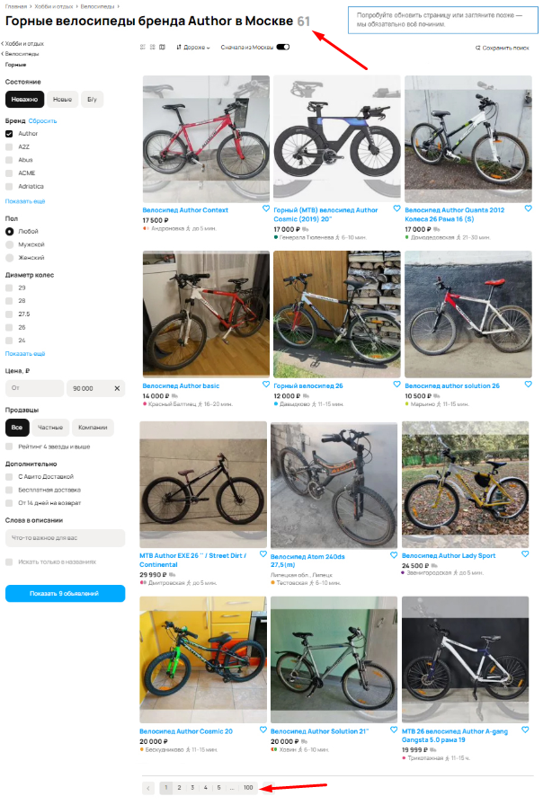

10. **Некорректное отображение количества объявлений в кнопке "Показать объявления"**
    - Описание: На кнопке "Показать объявления" отображается 9 объявлений, но на деле отображается что найдено 61 объявление.
    - Приоритет: Low
    - Аргументация: Данные на кнопке вводят в заблуждение, но пользователи все равно могут увидеть верное количество объявлений после нажатия.
    
    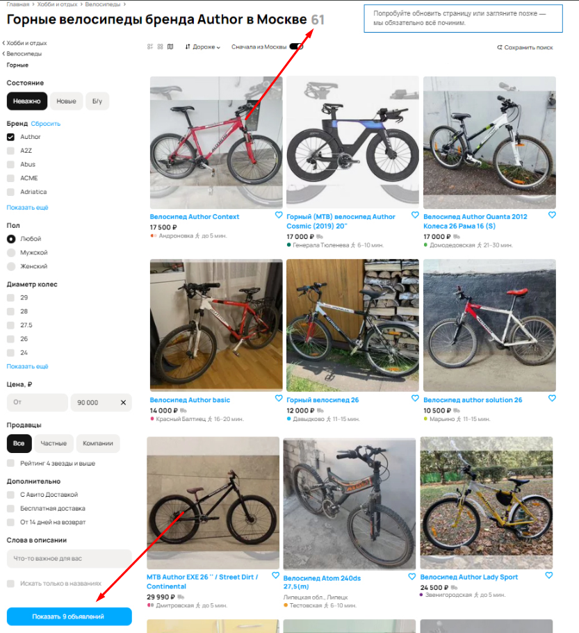

11. **Орфографическая ошибка в наименовании станции метро "Ховин"**
    - Описание: Орфографическая ошибка в названии станции метро Ховрино
    - Приоритет: Low
    - Аргументация: Визуальная ошибка, не влияющая на функциональность поиска. Однако может вызвать путаницу у пользователей.
    
    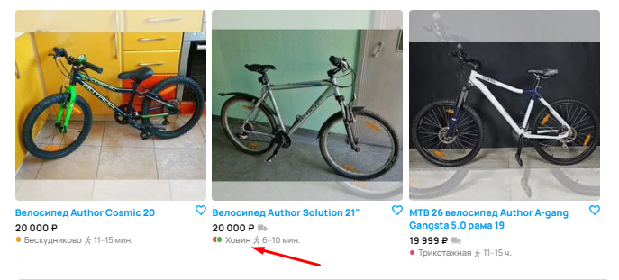

12. **В результате поиска попал товар другого бренда**
    - Описание: В результате поиска попал товар не от бренда "Author", хотя стоит фильтрация.
    - Приоритет: High
    - Аргументация: Если фильтр по бренду не работает, пользователи получают нерелевантные объявления, что снижает точность поиска и может оттолкнуть пользователей.
    
    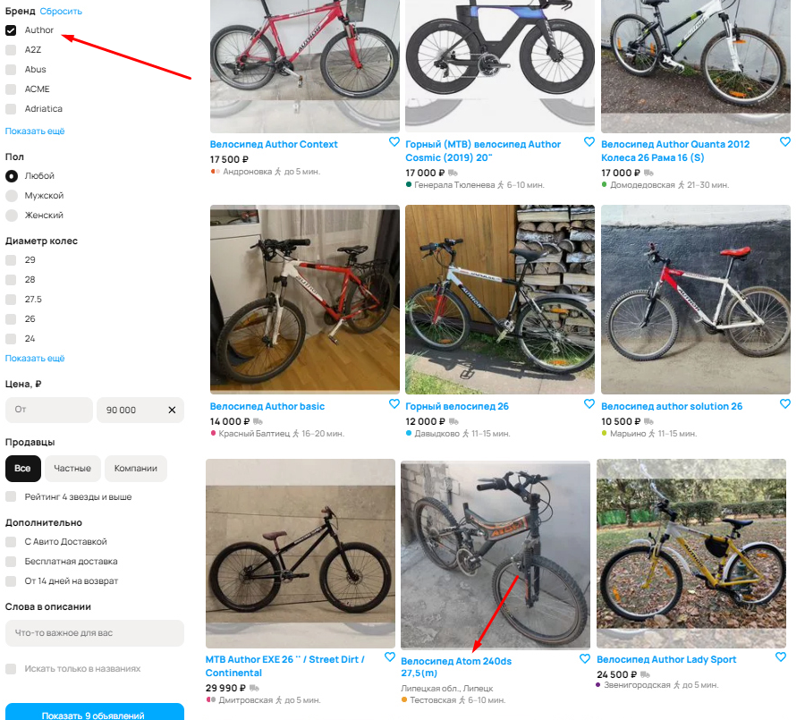